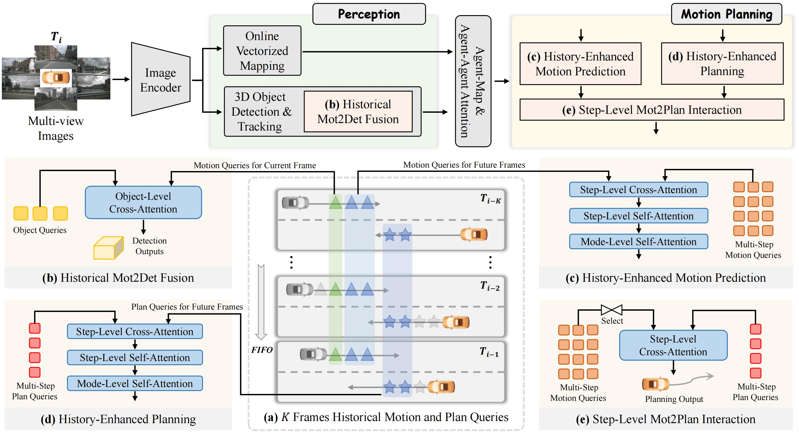

# Bridging Past and Future: End-to-End Autonomous Driving with Historical Prediction and Planning
### [[Paper]](https://arxiv.org/abs/2503.14182)

> [**Bridging Past and Future: End-to-End Autonomous Driving with Historical Prediction and Planning**](https://arxiv.org/abs/2503.14182)            
> [Bozhou Zhang](https://zbozhou.github.io/), [Nan Song](https://scholar.google.com/citations?hl=zh-CN&user=wLZVtjEAAAAJ), [Xin Jin](https://scholar.google.com/citations?user=byaSC-kAAAAJ&hl=zh-CN), [Li Zhang](https://lzrobots.github.io)  
> **CVPR 2025**

## 🚗 Abstract
End-to-end autonomous driving unifies tasks in a differentiable framework, enabling planning-oriented optimization and attracting growing attention. Current methods aggregate historical information either through dense historical bird's-eye-view (BEV) features or by querying a sparse memory bank, following paradigms inherited from detection. However, we argue that these paradigms either omit historical information in motion planning or fail to align with its multi-step nature, which requires predicting or planning multiple future time steps. In line with the philosophy of future is a continuation of past, we propose BridgeAD, which reformulates motion and planning queries as multi-step queries to differentiate the queries for each future time step. This design enables the effective use of historical prediction and planning by applying them to the appropriate parts of the end-to-end system based on the time steps, which improves both perception and motion planning. Specifically, historical queries for the current frame are combined with perception, while queries for future frames are integrated with motion planning. In this way, we bridge the gap between past and future by aggregating historical insights at every time step, enhancing the overall coherence and accuracy of the end-to-end autonomous driving pipeline. Extensive experiments on the nuScenes dataset in both open-loop and closed-loop settings demonstrate that BridgeAD achieves state-of-the-art performance.

## 🎞️ Pipeline
<div align="center">
  
</div><br/>

## ⭐ Qualitative Results

### Open-loop planning

https://github.com/user-attachments/assets/2abbe46c-5fe7-4d55-9f8e-a5caa82c394d

### Closed-loop planning

https://github.com/user-attachments/assets/5877b0ca-4844-4796-b77c-cf98e23cc146

## 🛠️ Get started

### Environment & data
Please follow the instructions in [SparseDrive](https://github.com/swc-17/SparseDrive) to set up the environment and prepare the nuScenes dataset.

### Train & test
```
# Train (stage 1 and stage 2)
sh scripts/train.sh

# Test
sh scripts/test.sh
```

## 📜 BibTeX
```bibtex
@inproceedings{zhang2025bridging,
 title={Bridging Past and Future: End-to-End Autonomous Driving with Historical Prediction and Planning},
 author={Zhang, Bozhou and Song, Nan and Jin, Xin and Zhang, Li},
 booktitle={CVPR},
 year={2025},
}
```

## ❤️ Acknowledgements
 - [SparseDrive](https://github.com/swc-17/SparseDrive)
 - [NeuroNCAP](https://github.com/atonderski/neuro-ncap)
 - [DeMo (Ours)](https://github.com/fudan-zvg/DeMo)
 - [RealMotion (Ours)](https://github.com/fudan-zvg/RealMotion)
